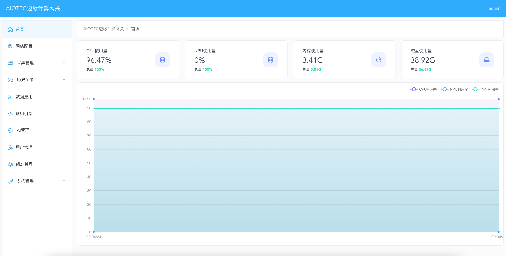
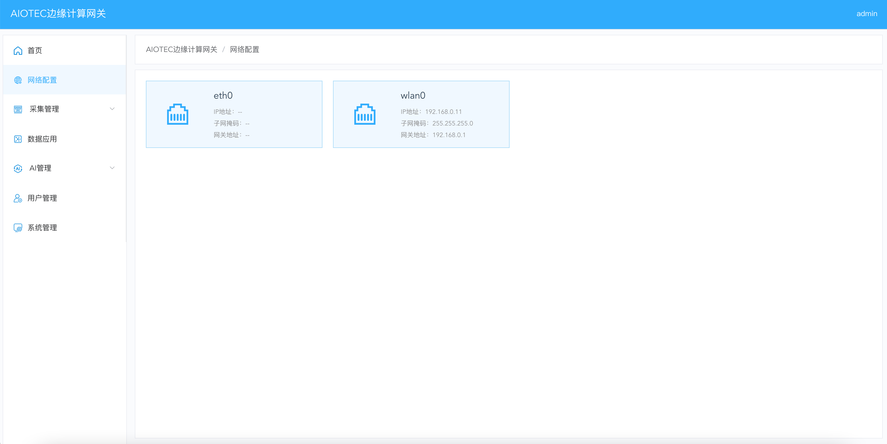
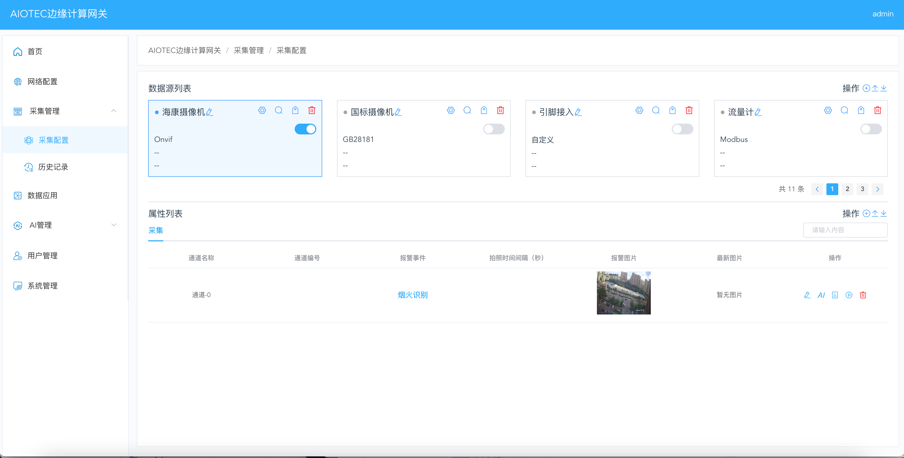
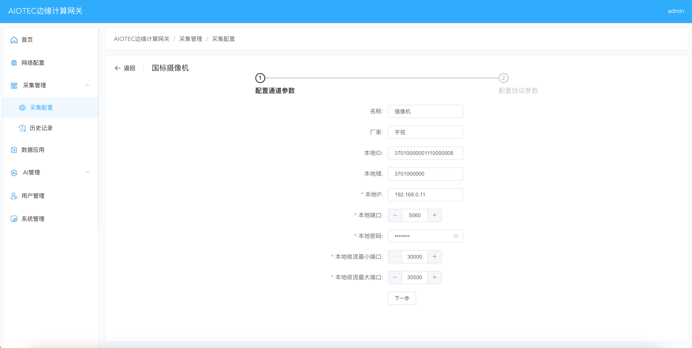
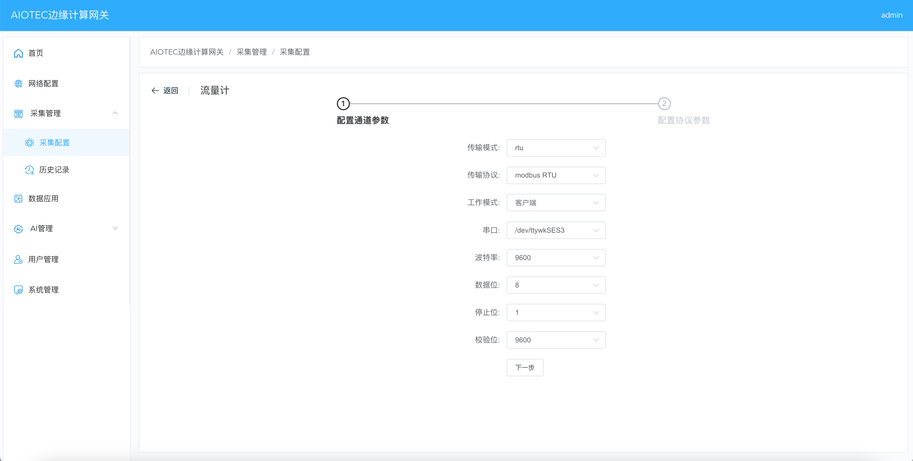
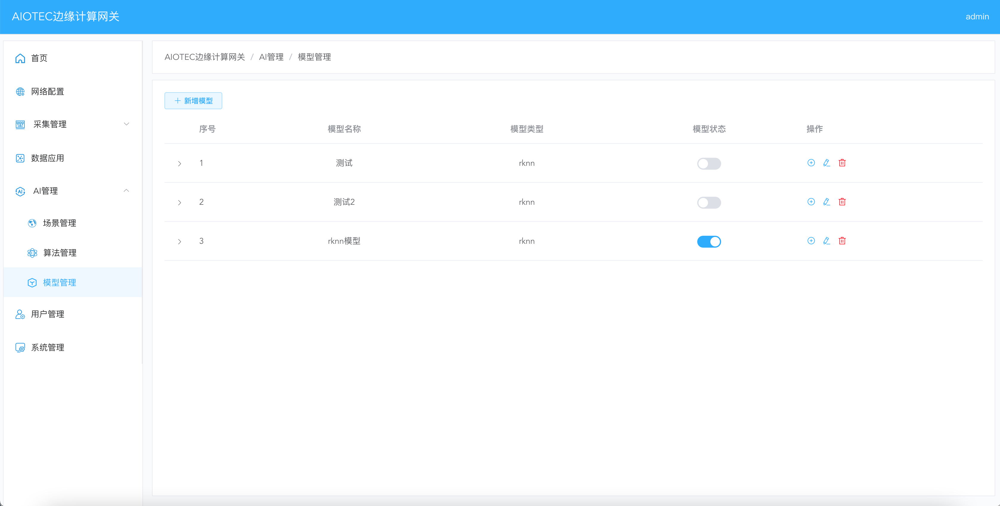
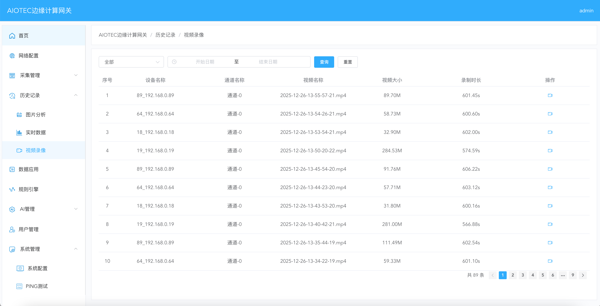
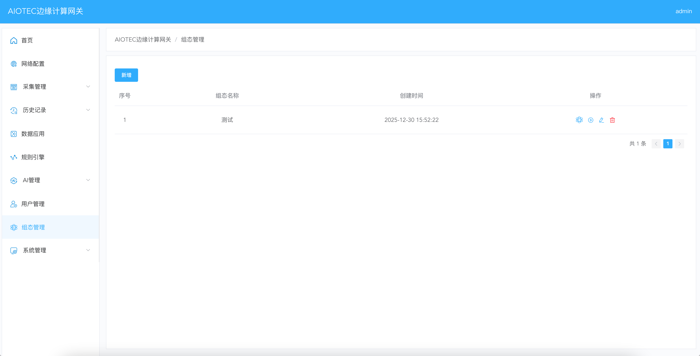
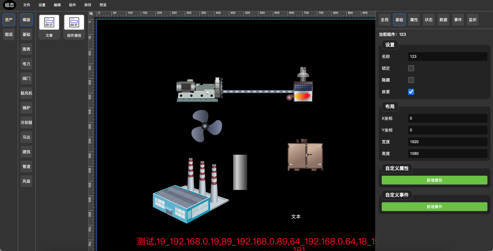
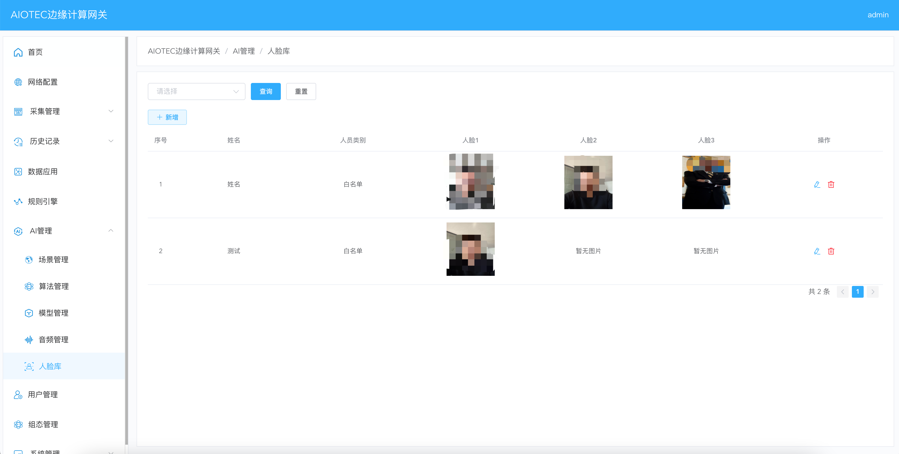

#  AIOTEC Gatewaybox

[AIOTEC 产品文档](http://www.wisdiot.com/doc/)

## 介绍

AIOTEC 是新一代开源边缘计算系统，B/S架构可视化配置，是创新融合 RTU 系统与视觉边缘计算系统。它支持多协议物联网设备接入，可实时采集控制数据，同时搭载深度学习框架，在边缘侧高效完成实时视觉分析，响应快且省带宽。适用于工业制造、智慧城市、智慧农业等场景。
该项目采用Apache-2.0开源协议。架构主要编程语言C++，适配arm64系统。
我们期望AIOTEC能够为使用人员提供更加高效、便捷、智能的体验。

### 特性

- 支持瑞芯微rk3568/rk3588架构、Debian11操作系统；
- 物联中枢：多协议融合接入：兼容ONVIF、GB28181、MODBUS、DLT645、IEC104、PLCS7等协议，支持PLC、OPCUA、传感器、仪表、zigbee等设备接入；
- 视觉分析：基于瑞芯微NPU（后期适配昇腾、英伟达）实现模型毫秒级响应，支持分析视频流、录像分析，支持Qwen3-VL大模型；
- 算法支持：火焰识别、未带安全帽、人脸识别、车牌识别、人员跌倒、人员聚集、流量计数等；
- 数据上报：物联网采集数据、直播视频流、分析结果视频流上报平台、104协议应用、断网续传；
- 组态系统：无需编程基础，通过拖拽图形模块就能快速实现设备监控、数据展示和自动化控制，大幅提升工业自动化效率；
- 规划功能：基于大模型对非结构化数据进行分析提供预测维护等；
- 反馈并提交误报情况，帮助我们进一步改善算法精确度。

### 架构

### 项目部分截图
首页

网络配置

采集配置

GB28181

Modbus

模型管理（YOLO、大模型）

规则引擎

视频录像

###新增功能
组态系统

人脸黑白名单

## 开发计划

- 工业协议持续添加开发；
- 协议加密传输

## 运行流程

### 要求

- Debian11
- 瑞芯微rk3568/rk3588

### 安装

- 在系统目录下以root身份克隆仓库文件，例如：

	git clone https://github.com/zhangedwin/aiotec.git

- 切换到相应架构的安装文件目录，例如：

	cd /soft/aiotec/bin/aarch64
	
- 添加可执行权限

	chmod +x gatewayclient

- 执行启动脚本，例如：

	./gatewayclient &
	
- 浏览器输入 http://127.0.0.1 可访问系统，也可使用设备ip地址访问，默认端口号为80

备注：
系统的账户名为 admin, 密码为 admin123
操作系统重启后服务会自动启动，替换版本时请先停止服务

- 手动停止服务，例如：
	
	systemctl stop gateway-client
	
- 手动启动服务，例如：
	
	systemctl start gateway-client

联系我们：

