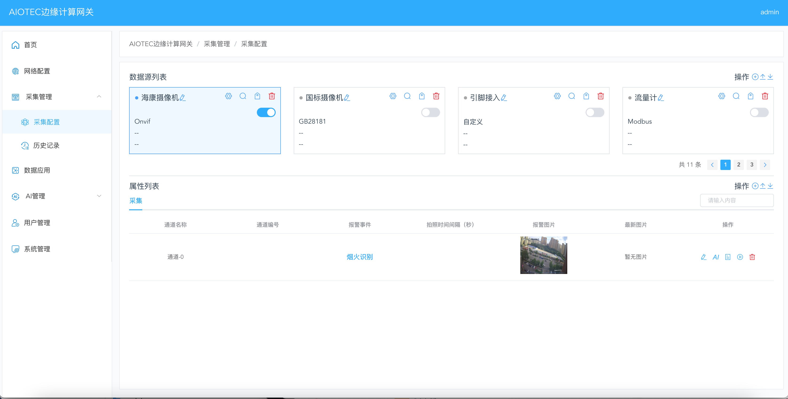

#  AIOTEC Gatewaybox

[AIOTEC 文档](https://www.yuque.com/shiyuchuxin-ci5ex/wcu9oy)

## 介绍

AIOTEC 是新一代开源边缘计算系统，B/S架构可视化配置，是创新融合 RTU 系统与视觉边缘计算系统。它支持多协议物联网设备接入，可实时采集控制数据，同时搭载深度学习框架，在边缘侧高效完成实时视觉分析，响应快且省带宽。适用于工业制造、智慧城市、智慧农业等场景。
该项目采用Apache-2.0开源协议。架构主要开发语言为C++，适配arm64、amd64、x86等系统。
我们期望AIOTEC能够为使用人员提供更加高效、便捷、智能的体验。

### 特性

- 支持瑞芯微rk3568/rk3588架构、Debian11操作系统；
- 物联中枢：多协议融合接入：兼容Modbus、MQTT、TCP/UDP、http等协议，支持PLC、传感器、仪表等传统设备接入；
- 视觉分析：基于瑞芯微NPU（后期适配昇腾、英伟达）实现模型毫秒级响应；
- 规划功能：多模态分析：支持大模型对结构化和非结构化数据进行分析；
- 反馈并提交误报情况，帮助我们进一步改善算法精确度。

### 架构

### 项目部分截图
首页

网络配置

采集配置

GB28181

Modbas

模型管理（YOLO、大模型）

## 开发计划

- 开发自动化安装脚本，实现“一键化”安装；
- 工业协议持续添加开发；
- 协议加密传输
- 多模态大模型支持

## 运行流程

### 要求

- Debian11
- 瑞芯微rk3568/rk3588

### 安装

- 在系统目录下克隆仓库文件，例如：

	git clone https://gitee.com/jizhi_shandong/aiotec.git

- 切换到安装文件目录，例如：

	cd /soft/aiotec

- 执行启动脚本，例如：

	./gatewayclient &
	
- 浏览器输入 http://127.0.0.1 可访问系统，也可使用设备ip地址访问，默认端口号为80

备注：
系统的账户名为 admin, 密码为 jizhi@123
操作系统重启后服务会自动启动，

联系我们：

